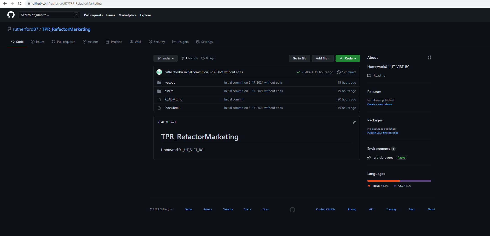

# TPR_RefactorMarketing
ReadMe file for HomeWork-01

HomeWork-01 was a refactoring exercise. 

Contents of repo:
* index.html
* style.css
* README.md

The original index.html and original style.css have been cleaned up following the _Scouts Rule_ and include comments explaning changes.

The repo can be found here: 
[TPR_GitHub](https://github.com/rutherford87/TPR_RefactorMarketing)

The website can be viewed here: [Horiseo Main Page](https://rutherford87.github.io/TPR_RefactorMarketing/)

Example of the final repo: 

